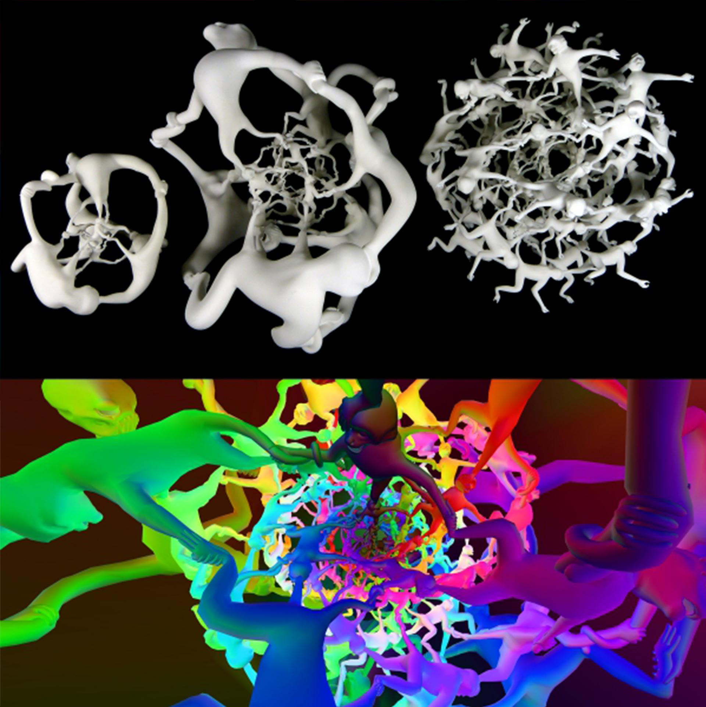

The web at it's best is wild, weird and creative. Monkeys by <a href="https://twitter.com/vihartvihart" target="_blank">Vi Hart</a> of <a href="http://elevr.com/" target="_blank">eleVR</a> is a surreal example of that ethos, placing us inside a seamless sequence of colorful primates. The result is whimsical and strange, but also an interesting exploration of the use of space in virtual reality. There are no flat planes here!

The math behind the piece is actually quite involved, as explained in the <a href="http://gallery.bridgesmathart.org/exhibitions/2015-bridges-conference/monkeys">making of breakdown</a>: "This piece consists of three 3D printed sculptures together with an associated virtual reality experience. The three sculptures visualise different 4D symmetry groups. A monkey motif is placed in each cube, octahedron or dodecahedron of the 8-, 24- or 120-cell, giving objects with symmetry groups the 8-element quaternion group, the binary tetrahedral group, and the binary icosahedral group respectively. The designs are radially projected to the 3-sphere then stereographically projected to 3-space. The VR experience animates each of these, showing one generator of each symmetry group. The virtual monkeys are coloured by an algorithm based on the Hopf fibration from the 3-sphere to the 2-sphere, which is then embedded in the RGB colour cube."

